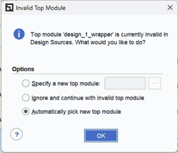
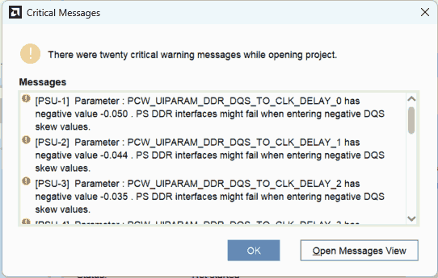
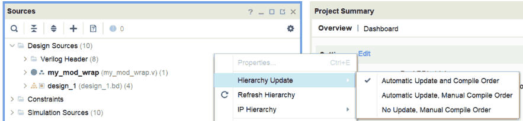
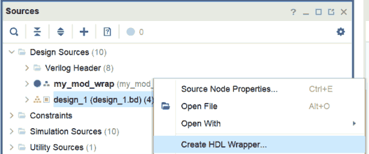

# PeakRDL trial

An example synthesizable Vivado project using CSR generated by PeakRDL.

Almost all of the RTL source files are copied from the following source:

[https://github.com/motchy869/code-fractions/tree/main/FPGA/sim/CSR/PeakRDL_trial](https://github.com/motchy869/code-fractions/tree/main/FPGA/sim/CSR/PeakRDL_trial).

RTL source files unique to this project are just minor wrapper modules used for Block Design in Vivado.

## 1. Target device and IDE

|item|description|
|:--|:--|
|board|Zybo Z7-20|
|FPGA|xc7z020clg400-1|
|IDE|Vivado 2023.2|

## 2. Reconstruct the project

As shown in [this web page](https://support.xilinx.com/s/article/Revision-Control-with-a-Vivado-Project?language=ja), project can be reconstructed from `<project name>.xpr` file and `<project name>.srcs` folder.

Launch Vivado, then open `vivado_proj/PeakRDL_trial.xpr`.

A dialogue box about invalid top module shows up.
You should select 'Automatically pick ...' then press 'OK'.

---

**NOTE:**

If some errors saying that the IPs are out-of date, you have to upgrade them by following the Vivado's instructions.

---

A dialog box about PS DDR timing issues shows up, but they are **spurious** errors and can be safely ignored.

Make sure hierarchy update strategy is set to 'Automatic Update and Compile Order'.

Create HDL wrapper for `design_1` block design.
Choose 'Let Vivado manage wrapper and auto-update' then press 'OK'.

The dialog box about PS DDR timing issues shows up again, but they are spurious again and can be safely ignored.

Set `design_1_wrapper` as the top module.

Now the project is reconstructed.
You can go to the synthesis phase.
